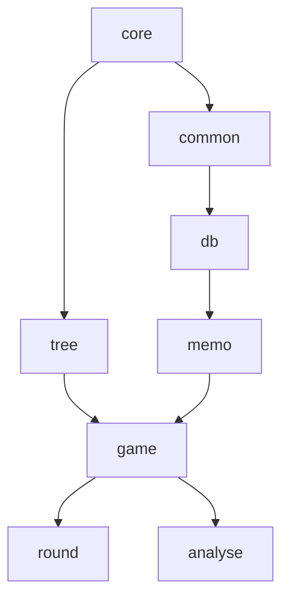

## Overview

Lichess is organized as a modular monolith with 83 Scala modules in the `modules/` directory. Each module represents a distinct feature or domain, promoting separation of concerns and maintainability.

## Architecture Principles

The module structure follows a layered dependency architecture:

- **Low-level modules** provide core functionality (database, common utilities)
- **Mid-level modules** implement domain logic (game, user, rating)
- **High-level modules** provide features and UI (tournament, study, web)

### Key Benefits

- **Separation of concerns**: Each module handles a specific domain
- **Clear dependencies**: Modules declare explicit dependencies
- **Testability**: Modules can be tested in isolation
- **Compilation order**: sbt compiles modules in dependency order

## Module Layers

The `build.sbt` file defines the compilation order based on dependency levels:

### Level 1: Foundation

```scala
core, coreI18n
```

- **core**: Base types, utilities, and domain primitives
- **coreI18n**: Internationalization core functionality

### Level 2: Presentation

```scala
ui, common, tree
```

- **ui**: UI templates and routing (uses scalatags)
- **common**: Shared utilities used across modules
- **tree**: Chess move tree data structures

### Level 3: Infrastructure

```scala
db, room, search
```

- **db**: MongoDB database access layer
- **room**: Real-time room functionality (chat, presence)
- **search**: Elasticsearch integration

### Level 4: Services

```scala
memo, rating
```

- **memo**: Caching and memoization (using Caffeine)
- **rating**: Glicko-2 rating calculations

### Level 5: Core Domain

```scala
game, gathering, study, user, puzzle, analyse,
report, pref, chat, playban, lobby, mailer, oauth
```

Key modules:
- **game**: Chess game logic and storage
- **user**: User accounts and profiles
- **study**: Shared chess analysis boards
- **puzzle**: Chess puzzles and training
- **analyse**: Computer analysis integration
- **tournament**: Tournament system base
- **gathering**: Base for tournaments and simuls

### Level 6: Analytics

```scala
insight, evaluation, storm
```

- **insight**: Player statistics and insights
- **evaluation**: Position evaluation
- **storm**: Speed puzzle training mode

### Level 7: Features

```scala
relay, security, tournament, plan, round, swiss,
fishnet, tutor, mod, challenge, web, team, forum,
streamer, simul, activity, msg, ublog, notifyModule,
clas, perfStat, opening, timeline, setup, video,
fide, title, push, pool, relation, tv, coordinate,
feed, history, recap, shutup, appeal, irc, explorer,
learn, event, coach, practice, evalCache, irwin,
bot, racer, cms, i18n, jsBot, socket, bookmark,
studySearch, gameSearch, forumSearch, teamSearch
```

## Key Modules Explained

### Game and Play

#### game
`modules/game/src/main/`

Core game logic:
- Game state management
- Move validation (via scalachess)
- Game storage and retrieval
- PGN export

```scala
module("game",
  Seq(tree, rating, memo),
  Seq(compression) ++ tests.bundle
)
```

#### round
`modules/round/src/main/`

Live game rounds:
- Real-time game orchestration
- Move processing
- Time control
- Resignation/draw offers

```scala
module("round",
  Seq(room, game, user, playban, pref, chat),
  Seq(hasher, kamon.core, lettuce) ++ tests.bundle
)
```

### User and Social

#### user
`modules/user/src/main/`

User management:
- User accounts
- Authentication
- Profiles and preferences
- Rankings and leaderboards

#### team
`modules/team/src/main/`

Team functionality:
- Team creation and management
- Team forums
- Team tournaments

#### relation
`modules/relation/src/main/`

Social connections:
- Following/followers
- Blocking
- Friend relationships

### Learning and Training

#### puzzle
`modules/puzzle/src/main/`

Puzzle system:
- Puzzle database
- Difficulty rating
- User progress tracking

#### study
`modules/study/src/main/`

Collaborative analysis:
- Shared analysis boards
- Chapters and variations
- Comments and glyphs
- Study search (studySearch)

#### learn
`modules/learn/src/main/`

Interactive chess lessons for beginners.

### Tournaments and Events

#### tournament
`modules/tournament/src/main/`

Arena tournaments:
- Tournament creation
- Pairing algorithms
- Standings calculation
- Berserk mode

#### swiss
`modules/swiss/src/main/`

Swiss-system tournaments with perfect pairing.

#### simul
`modules/simul/src/main/`

Simultaneous exhibitions where one player faces many.

### Analysis and AI

#### analyse
`modules/analyse/src/main/`

Game analysis:
- Server-side analysis requests
- Analysis display
- Computer evaluation

#### fishnet
`modules/fishnet/src/main/`

Stockfish cluster integration:
- Analysis job distribution
- Move evaluation
- Client management

#### evalCache
`modules/evalCache/src/main/`

Caches position evaluations to avoid redundant analysis.

### Moderation

#### mod
`modules/mod/src/main/`

Moderation tools:
- User reports
- Mod actions
- IP/email checks

#### report
`modules/report/src/main/`

User reporting system.

#### irwin
`modules/irwin/src/main/`

Cheat detection integration.

#### appeal
`modules/appeal/src/main/`

User ban appeals.

### Infrastructure

#### db
`modules/db/src/main/`

Database utilities:
- MongoDB connection management
- Collection helpers
- Query builders

#### socket
`modules/socket/src/main/`

WebSocket integration with lila-ws:
- Socket communication
- Redis pub/sub
- User presence

#### search
`modules/search/src/main/`

Elasticsearch integration for game/forum/study/team search.

#### mailer
`modules/mailer/src/main/`

Email notifications and transactional emails.

### Web and API

#### web
`modules/web/src/main/`

Web server and HTTP handling:
- Play Framework integration
- Request routing
- Response rendering

#### api
`modules/api/src/main/`

Public HTTP API:
- REST endpoints
- API documentation
- Rate limiting
- OAuth integration

## Module Definition

Modules are defined in `build.sbt` using the `module()` helper:

```scala
lazy val game = module("game",
  Seq(tree, rating, memo),  // Dependencies on other modules
  Seq(compression) ++ tests.bundle  // External library dependencies
)
```

### Module Structure

Each module follows a standard directory layout:

```
modules/game/
├── src/
│   ├── main/
│   │   └── [ModuleName].scala  // Module entry point
│   │   └── ...                 // Domain code
│   └── test/
│       └── ...                 // Test files
```

## Dependency Graph

The module dependencies form a directed acyclic graph (DAG). You can visualize dependencies at:

**[github.com/ornicar/lila-dep-graphs](https://github.com/ornicar/lila-dep-graphs)**

### Example Dependencies



## Working with Modules

### Adding a New Module

<Steps>

### Create module directory

```bash
mkdir -p modules/mymodule/src/main
mkdir -p modules/mymodule/src/test
```

### Add module definition to build.sbt

```scala
lazy val mymodule = module("mymodule",
  Seq(common),  // Dependencies
  Seq()  // External libraries
)
```

### Add to modules list

Add `mymodule` to the `modules` sequence in `build.sbt` in the appropriate dependency level.

### Create module entry point

`modules/mymodule/src/main/MyModule.scala`:

```scala
package lila.mymodule

final class MyModuleApi(
  // Inject dependencies
)
```

</Steps>

### Module Dependencies

**Declaring dependencies:**

```scala
lazy val mymodule = module("mymodule",
  Seq(common, db, user),  // Internal module deps
  Seq(caffeine) ++ tests.bundle  // External deps
)
```

**Test dependencies:**

```scala
.dependsOn(common % "test->test")  // Access test utilities
```

## External Dependencies

Common external dependencies used across modules:

```scala
// Caching
scaffeine, caffeine

// Redis
lettuce

// Testing
tests.bundle  // Includes munit, scalacheck

// Monitoring
kamon.core, kamon.influxdb

// Web
playWs.bundle

// Macros
macwire.bundle
```

## Chess Logic

Pure chess logic is contained in the **scalachess** submodule:

- Move generation
- Position validation
- PGN parsing
- FEN handling

```scala
chess.bundle  // Includes scalachess and related libs
```

## Next Steps

- Explore [UI development](/development/ui-development) for frontend modules
- Learn about [building](/development/building) specific modules
- Read about [testing](/development/testing) module code

## Additional Resources

- [build.sbt source](https://github.com/lichess-org/lila/blob/master/build.sbt)
- [Dependency graphs](https://github.com/ornicar/lila-dep-graphs)
- [scalachess repository](https://github.com/lichess-org/scalachess)
